# WireGuard VPN for Webmin

[Русская версия](README.ru.md)

A Webmin module for managing WireGuard `wg-quick` interfaces and peers stored
in standard `.conf` files.

**Stable release:** `0.2.0`

## Features

- interface and peer CRUD with start, stop, restart and runtime apply;
- named peers stored in comments without introducing a separate database;
- enabled and disabled peers preserved in the WireGuard configuration file;
- client configuration generation, download and QR code export;
- automatic public-key derivation when a private key is supplied;
- first-free tunnel address suggestion and overlap detection for IPv4/IPv6;
- live and historical TX/RX graphs with a centered zero axis;
- asynchronous runtime state, handshakes, endpoints and traffic counters;
- bounded background metrics collector with systemd resource limits;
- ping, traceroute and TCP-port diagnostics with incremental output;
- WireGuard and interface journal views;
- separate Webmin ACLs for viewing, management, export, diagnostics, logs and
  optional dependency installation;
- CSRF protection, request throttling and atomic configuration writes.

## Interface examples

The examples use the English Webmin locale and the module's English
localization strings. Peer names, public endpoints, key material and QR-code
contents have been redacted. Private RFC 1918 addresses remain visible as
non-routable examples.

### Module overview

[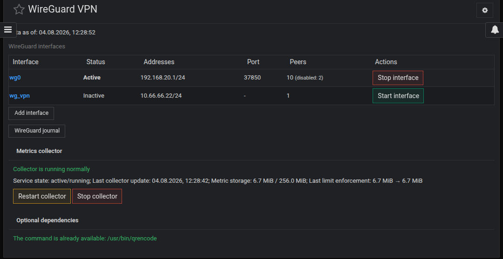](docs/images/en/main_screen.jpg)

### Interface management

[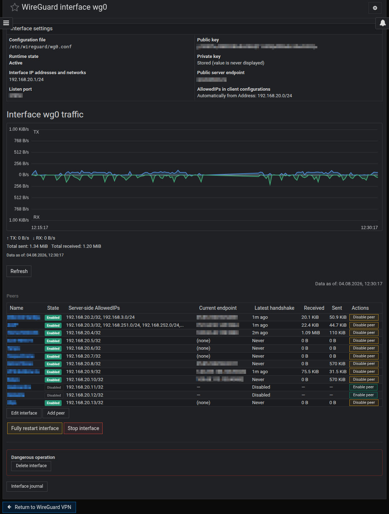](docs/images/en/interface_view.jpg)

### Peer management and client settings

[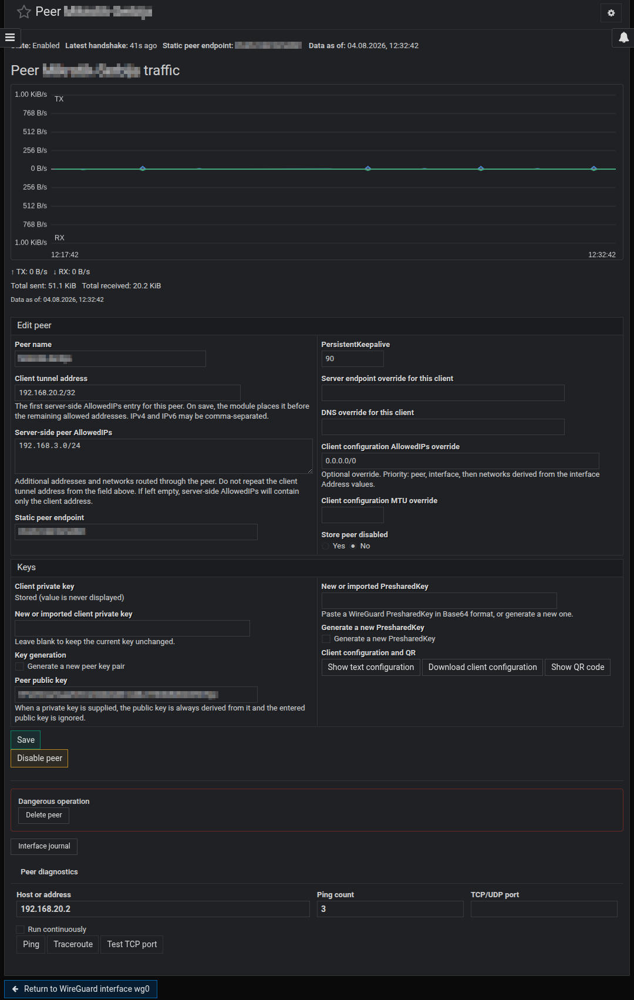](docs/images/en/peer_view.jpg)

### Diagnostics and interface journal

[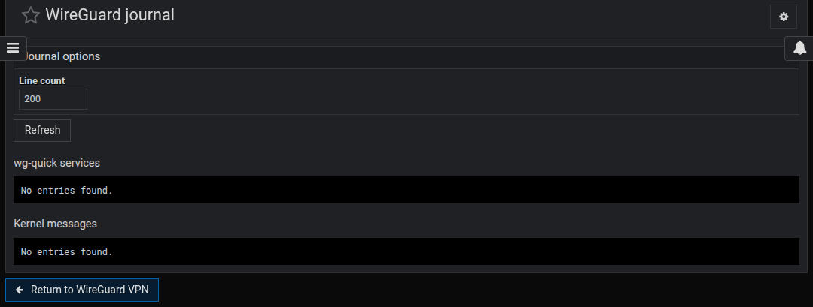](docs/images/en/journal_view.jpg)
[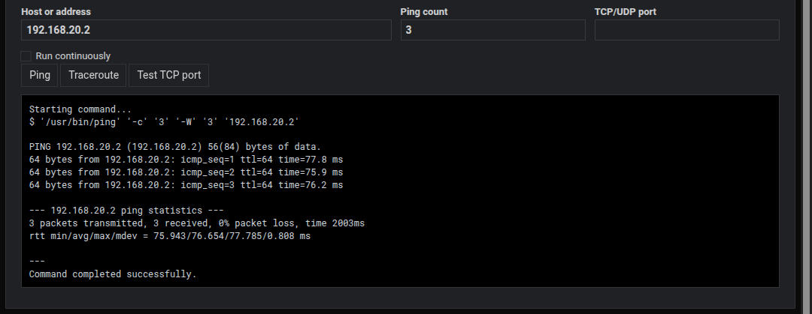](docs/images/en/peer_ping_sample.jpg)
[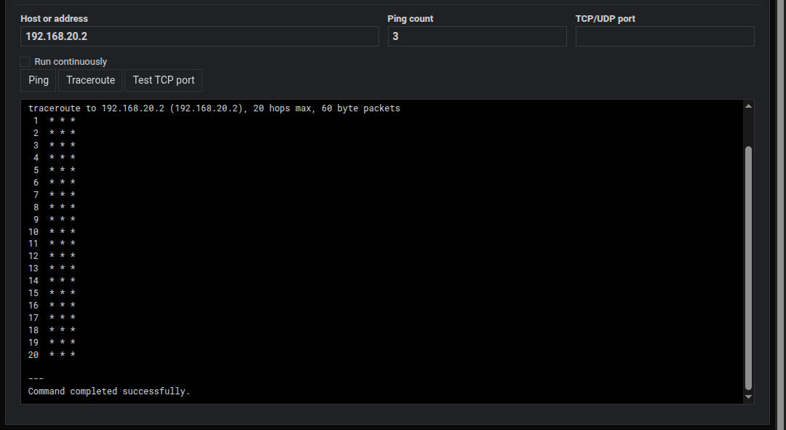](docs/images/en/peer_traceroute_sample.jpg)

### Client configuration and QR export

[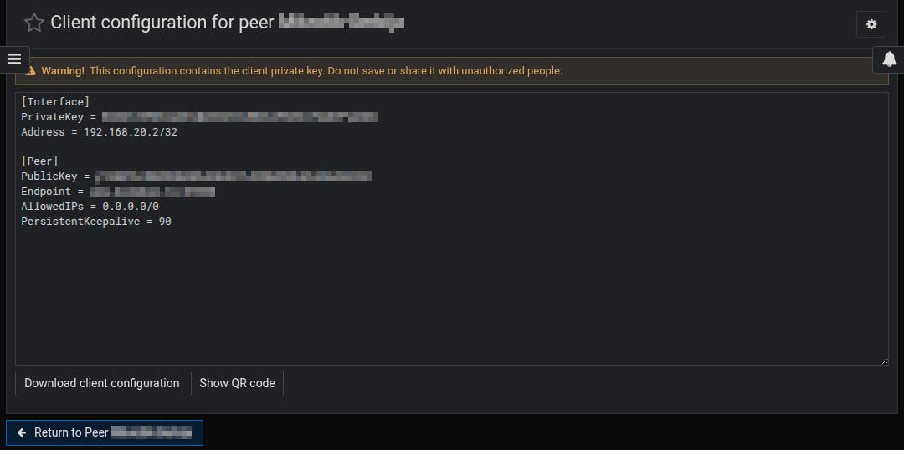](docs/images/en/peer_config_view.jpg)
[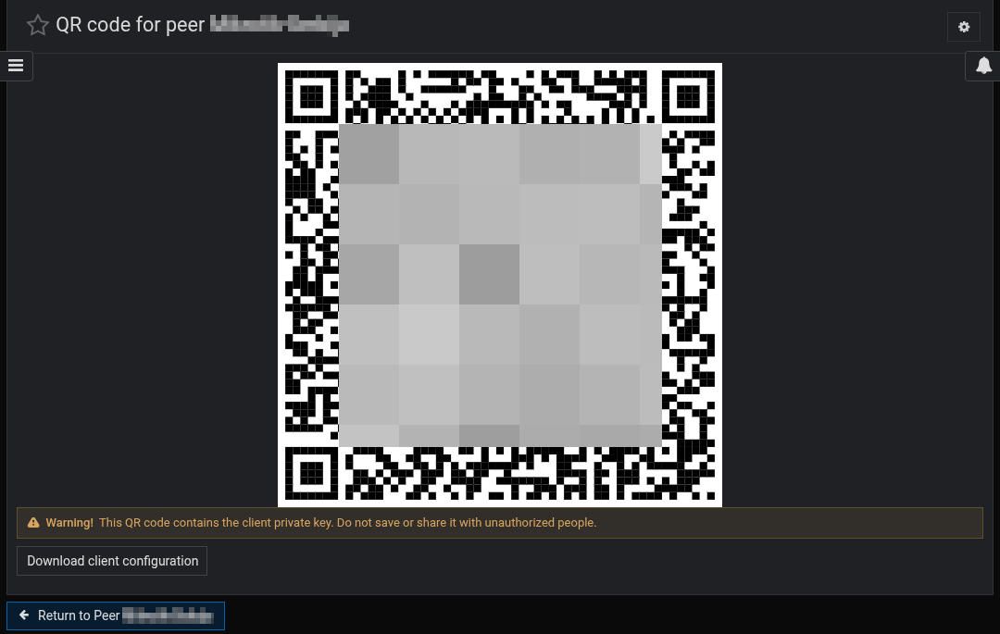](docs/images/en/peer_qr_view.jpg.jpg)

### Confirms

[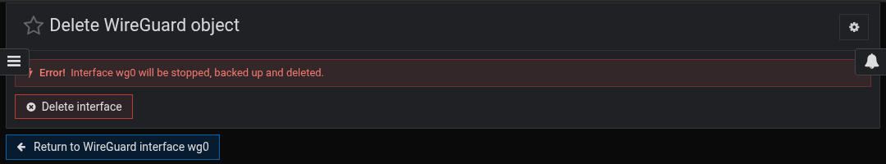](docs/images/en/interface_remove_confirm.jpg)
[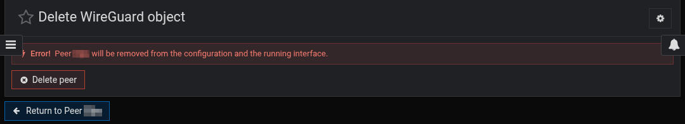](docs/images/en/peer_remove_confirm.jpg)
[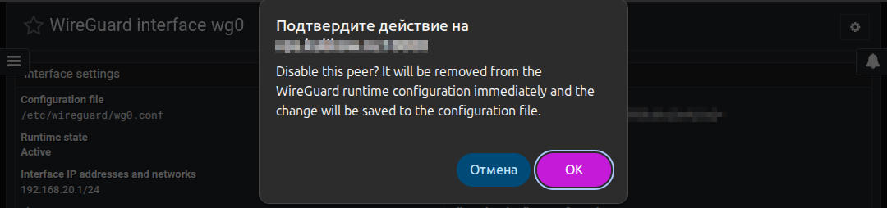](docs/images/en/peer_disable_confirm.jpg)

## Requirements

- Linux with Webmin and systemd;
- WireGuard tools (`wg`, `wg-quick`);
- Perl modules included with standard Perl/Webmin installations;
- `qrencode` is optional and can be installed explicitly from the module on
  Debian/Ubuntu when permitted by ACL.

## Installation

1. Download `webmin-wireguard-0.2.0.wbm.gz` from the release assets.
2. Open **Webmin → Webmin Configuration → Webmin Modules**.
3. Install the downloaded module file.
4. Open **Network → WireGuard VPN**.
5. Review module settings before changing production interfaces.

Detailed instructions: [docs/INSTALLATION.md](docs/INSTALLATION.md).

## Upgrade safety

An upgrade does not rewrite `/etc/wireguard/*.conf`, reset module settings,
delete metrics history or restart `wg-quick@...` services. The installer only
updates and, when necessary, restarts its own managed metrics collector. A
same-named systemd unit not recognized as module-managed is left unchanged.

## Security warning

A user with the `manage` ACL can edit `PreUp`, `PostUp`, `PreDown` and
`PostDown`; these commands run as root when `wg-quick` operates. Treat this ACL
as root-equivalent. Client private keys are stored server-side only when the
administrator deliberately supplies them for configuration/QR export.

Read [SECURITY.md](SECURITY.md) and [docs/SECURITY-REVIEW.md](docs/SECURITY-REVIEW.md)
before deployment.

## Project documentation

Architecture: [docs/ARCHITECTURE.md](docs/ARCHITECTURE.md).
Contributing and build instructions: [CONTRIBUTING.md](CONTRIBUTING.md).
Support checklist: [SUPPORT.md](SUPPORT.md).

## License

BSD 3-Clause. See [LICENSE](LICENSE).
