# WireGuard VPN для Webmin

[English](README.md)

Модуль Webmin для управления интерфейсами и пирами WireGuard, хранящимися в
стандартных конфигурационных файлах `wg-quick`.

**Стабильный релиз:** `0.2.0`

## Возможности

- полноценное управление интерфейсами и пирами;
- запуск, остановка, перезапуск и применение изменений без остановки;
- пользовательские имена пиров в комментариях `.conf`;
- хранение отключённых пиров в том же конфигурационном файле;
- формирование клиентского конфига, скачивание и QR-код;
- расчёт публичного ключа из переданного приватного;
- выбор первого свободного адреса и проверка пересечений IPv4/IPv6;
- live- и исторические графики TX/RX относительно центральной нулевой линии;
- асинхронное обновление состояния, handshake, endpoint и счётчиков;
- ограниченный по ресурсам systemd-сборщик метрик;
- ping, traceroute и проверка TCP-порта с поэтапным выводом;
- журналы WireGuard и отдельных интерфейсов;
- отдельные ACL Webmin для просмотра, управления, экспорта, диагностики,
  журналов и установки необязательной зависимости;
- CSRF-защита, ограничение частоты запросов и атомарное сохранение `.conf`.

## Примеры интерфейса

Скриншоты сделаны в русской локализации Webmin. Имена пиров, публичные endpoint,
ключевой материал и содержимое QR-кода скрыты. Внутренние адреса RFC 1918
оставлены как примеры, недоступные для маршрутизации в Интернете.

### Главная страница модуля

[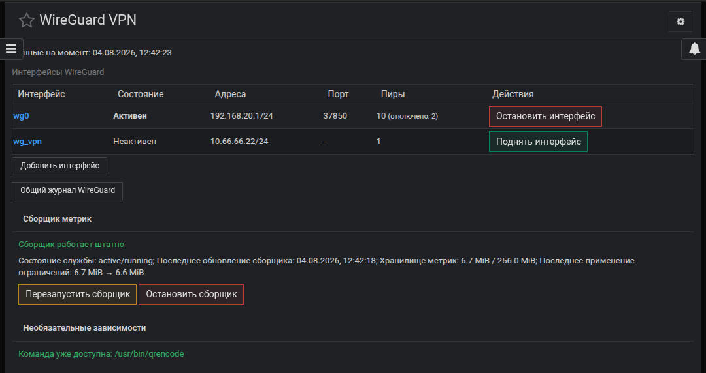](docs/images/ru/main_screen.jpg)

### Управление интерфейсом и пирами

[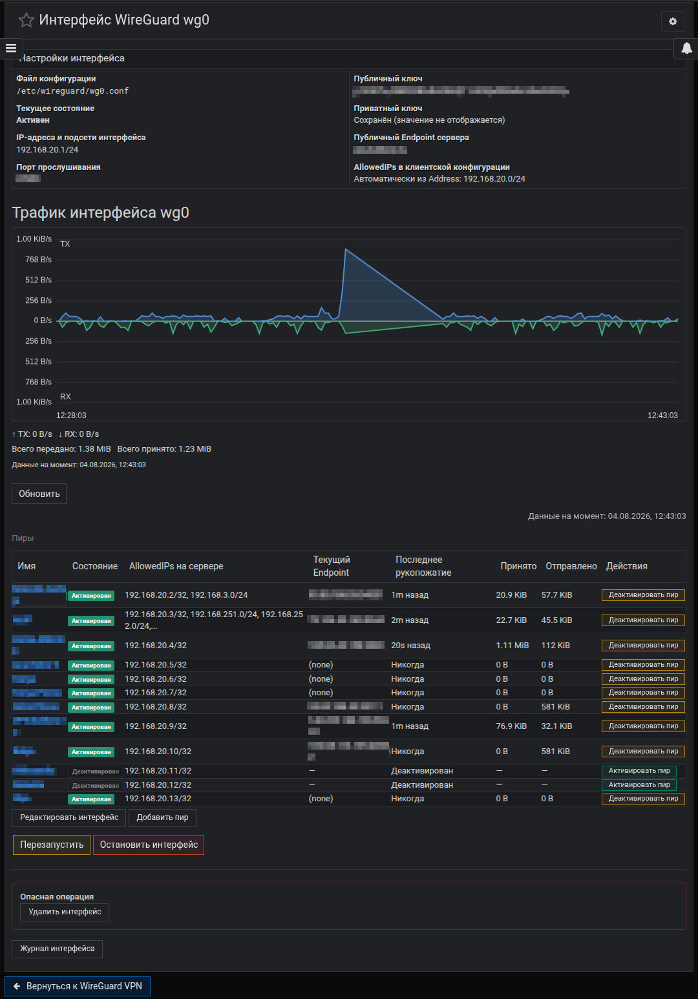](docs/images/ru/interface_view.jpg)

На странице показаны текущее состояние, график трафика, статусы пиров,
AllowedIPs и элементы управления интерфейсом и пирами.

### Управление клиентами

[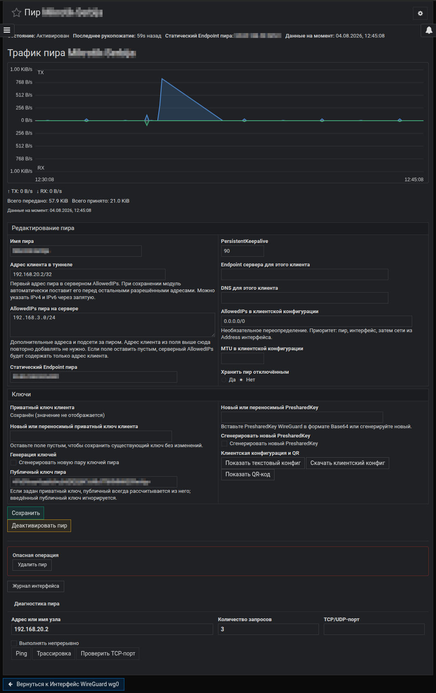](docs/images/ru/peer_view.jpg)

### Диагностика и журнал

[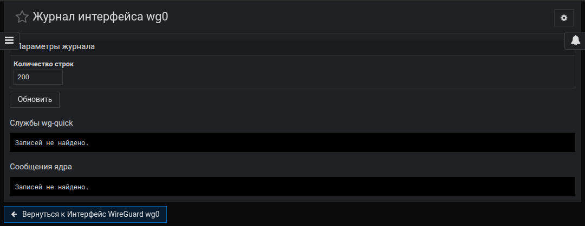](docs/images/ru/journal_view.jpg)
[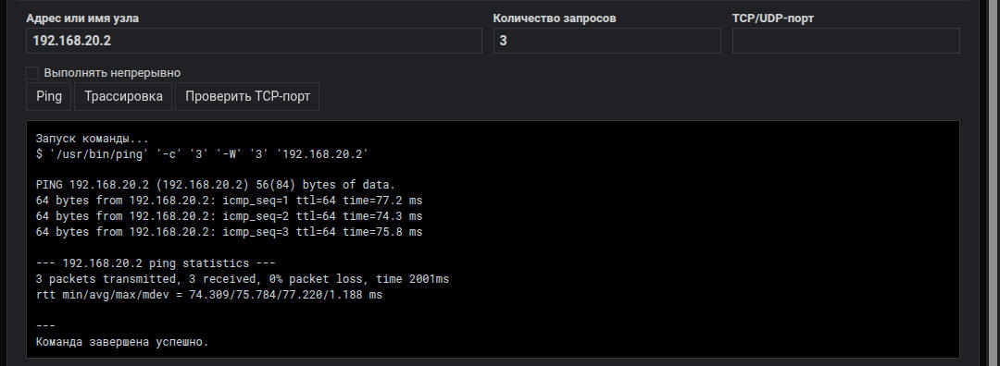](docs/images/ru/peer_ping_sample.jpg)
[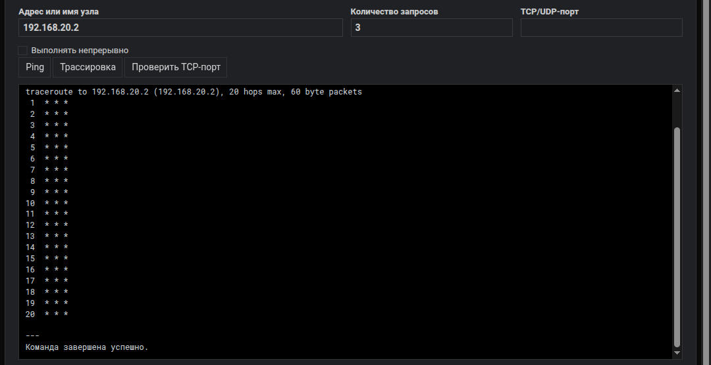](docs/images/ru/peer_traceroute_sample.jpg)

### Экспорт конфигураций клиента и QR-Code

[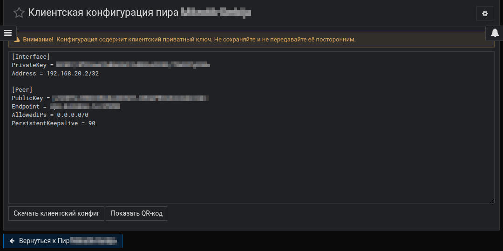](docs/images/ru/peer_config_view.jpg)
[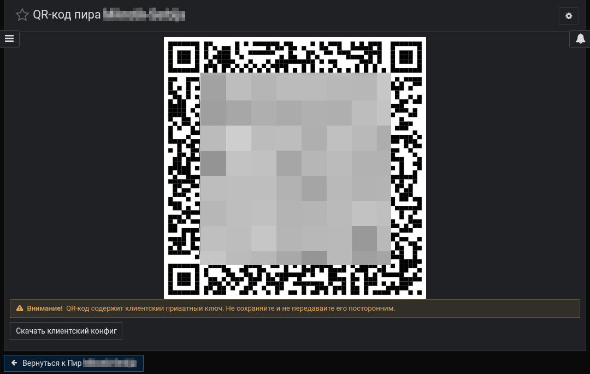](docs/images/ru/peer_qr_view.jpg.jpg)

### Подтверждения

[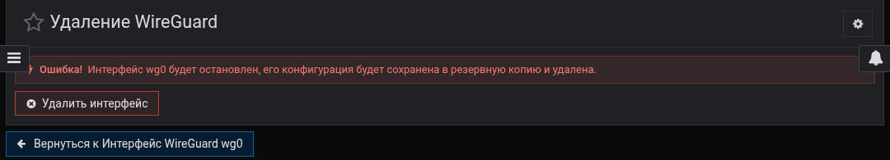](docs/images/ru/interface_remove_confirm.jpg)
[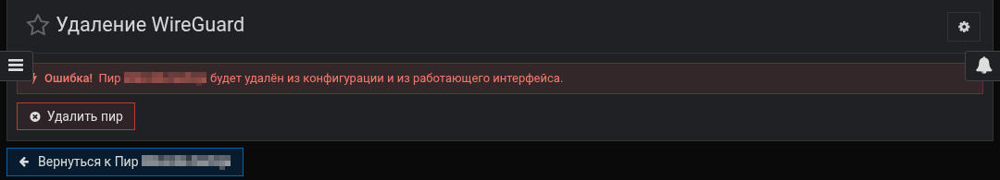](docs/images/ru/peer_remove_confirm.jpg)
[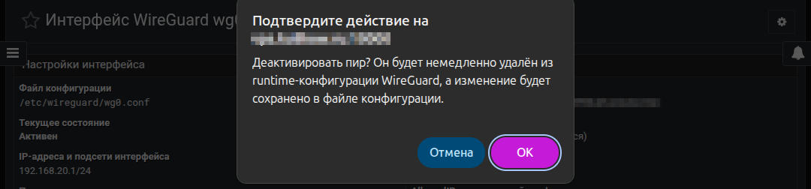](docs/images/ru/peer_disable_confirm.jpg)

## Требования

- Linux, Webmin и systemd;
- установленные `wg` и `wg-quick`;
- `qrencode` необязателен. На Debian/Ubuntu его можно установить из модуля при
  наличии соответствующего ACL.

## Установка

1. Скачать `webmin-wireguard-0.2.0.wbm.gz` из файлов релиза.
2. Открыть **Webmin → Настройка Webmin → Модули Webmin**.
3. Установить скачанный файл.
4. Открыть **Сеть → WireGuard VPN**.
5. Перед изменением рабочих интерфейсов проверить настройки модуля.

Подробно: [docs/INSTALLATION.md](docs/INSTALLATION.md).

## Поведение при обновлении

Обновление не переписывает `/etc/wireguard/*.conf`, не сбрасывает настройки, не
удаляет историю метрик и не перезапускает `wg-quick@...`. Обновляется только
собственная служба сборщика метрик; чужая одноимённая systemd-служба остаётся
нетронутой.

## Важное ограничение безопасности

ACL `manage` позволяет редактировать `PreUp`, `PostUp`, `PreDown`, `PostDown`.
Эти команды выполняются `wg-quick` с правами root, поэтому право управления
модулем фактически является root-эквивалентным. Приватные ключи клиентов
хранятся на сервере только при их явном вводе администратором для экспорта
конфигурации и QR.

Перед установкой прочитайте [SECURITY.md](SECURITY.md) и
[docs/SECURITY-REVIEW.md](docs/SECURITY-REVIEW.md).

## Документация проекта

Архитектура: [docs/ARCHITECTURE.md](docs/ARCHITECTURE.md).
Сборка и участие в разработке: [CONTRIBUTING.md](CONTRIBUTING.md).
Диагностика для обращения: [SUPPORT.md](SUPPORT.md).

Лицензия: BSD 3-Clause, см. [LICENSE](LICENSE).
